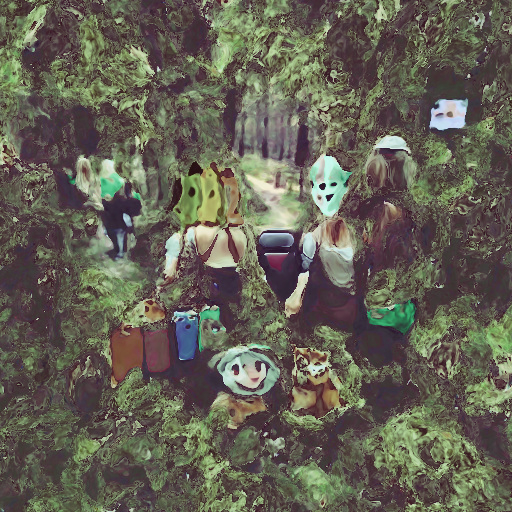

## Imagination Beauty

</img>

*friends go on a trip to the forest*


### Training
After we trained the network with 32 layers and 512 pixel image size
we get:

https://user-images.githubusercontent.com/76955730/160811029-2785093c-91b3-4fb2-9c51-5b6668357f8f.mp4


## Citations
```bibtex
@misc{unpublished2021clip,
    title  = {CLIP: Connecting Text and Images},
    author = {Alec Radford, Ilya Sutskever, Jong Wook Kim, Gretchen Krueger, Sandhini Agarwal},
    year   = {2021}
}
```
```bibtex
@misc{sitzmann2020implicit,
    title   = {Implicit Neural Representations with Periodic Activation Functions},
    author  = {Vincent Sitzmann and Julien N. P. Martel and Alexander W. Bergman and David B. Lindell and Gordon Wetzstein},
    year    = {2020},
    eprint  = {2006.09661},
    archivePrefix = {arXiv},
    primaryClass = {cs.CV}
}
```
